WordCRUD Program
================
단어를 추가하고 읽고 업데이트하고 삭제하는 등의 다양한 기능을 수행할 수 있는 프로그램이다.

Files
-----
Dictionary.txt 파일은 단어들이 저장되는 텍스트 파일이다.

Menu
----
==> 34개 로딩 완료!!!
*** 영단어 마스터 ***
  ********************
1. 모든 단어 보가
2. 수준별 단어 보기
3. 단어 검색
4. 단어 추가
5. 단어 수정
6. 단어 삭제
7. 파일 저장
0. 나가기
  ********************
=> 원하는 메뉴는?

Function
--------
+ commend 1: 단어장에 저장되어 있는 모든 단어를 보여준다.

  => 원하는 메뉴는? 1

  1

  1 *** superintendent  관리자, 감독관

  2 *         electric  전기의, 전기를 생산하는

  3 **       equipment  장비, 용품

  4 *             pole  기둥, 장대

  5 *         formerly  이전에, 예전에

  6 *         transfer  옮기다, 이동하다

  7 **       executive  경영 간부, 임원

  8 *           assure  안심시키다, 확신시키다

  9 **   embarrassment  당황, 난처함

  10 **       publicity  명성, 평판, 널리 알려짐, 공표

  11 ***    subordinate  부하의, 하급자의

  12 **         utility  공익사업(체), 유용성

  13 *             lone  혼자인, 단독의, 외딴

  14 *           glance  흘긋 보다, 대강 훑어보다

  15 **       conscious  의식하는, 자각하는

  16 **        overkill  지나침, 과잉

  17 **          stroll  거닐다, 산책하다

  18 *            stock  주식, 재고

  19 **      eye-opener  눈이 휘둥그레질 만한 사건, 놀라운 경험

  20 *         graceful  우아한

  21 **         seagull  갈매기

  22 *          tightly  단단히

  23 **          webbed  물갈퀴가 있는

  24 *    thoughtlessly  생각 없이

  25 *          discard  버리다

  26 *      unfortunate  불운한

  27 *           branch  나뭇가지

  28 *             trim  다듬다

  29 ***         crouch  쪼그리고 앉다

  30 **        proclaim  공언하다, 선포하다

  31 *          scatter  흩뿌리다, 살포하다

  32 *          proceed  진행하다[되다]

  33 *       reputation  평판, 명성

  34 *            apple  사과

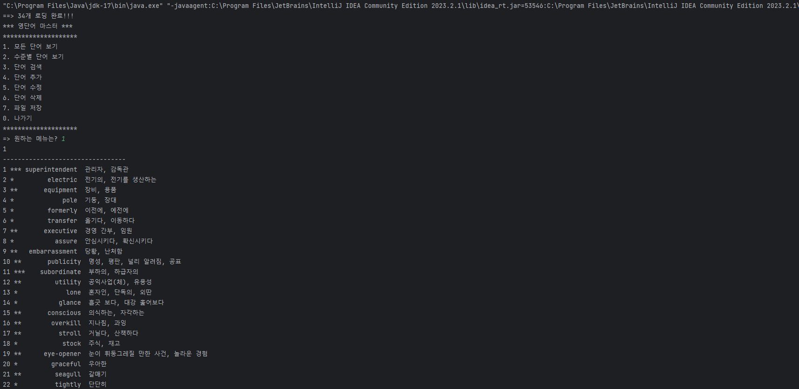
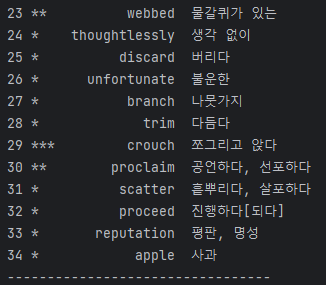

+ commend 2: 입력된 난이도와 같은 난이도를 가지고 있는 단어들을 보여준다.

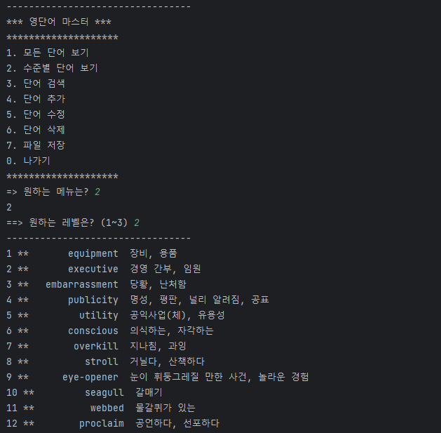

+ commend 3: 단어를 검색한다.

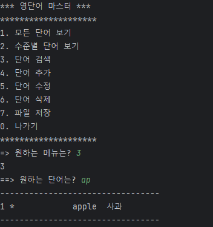

+ commend 4: 단어장에 단어를 추가한다.

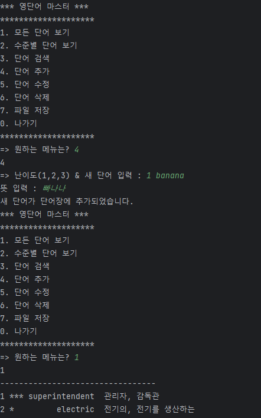
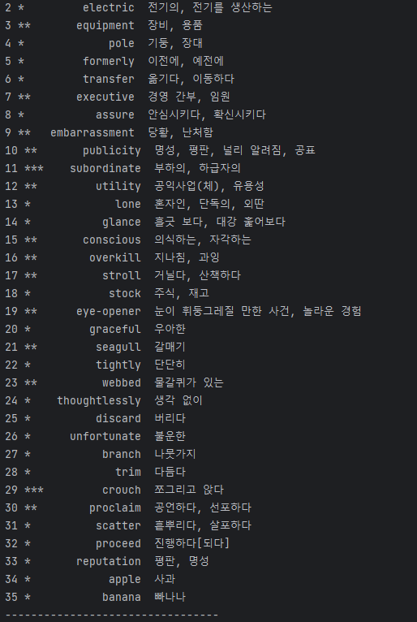

  '''=> 원하는 메뉴는? 4
  4
  => 난이도(1,2,3) & 새 단어 입력 : 1 apple
  뜻 입력 : 사과
  새 단어가 단어장에 추가되었습니다.'''

+ commend 5: 단어장에 있는 단어를 수정한다.

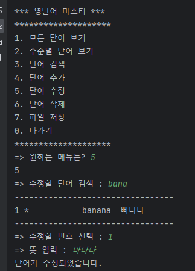
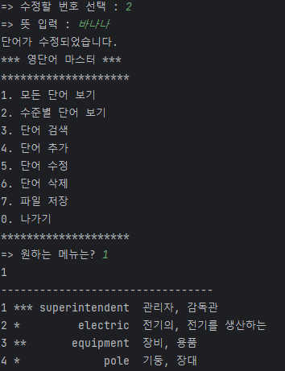

+ commend 6: 단어장에 저장되어 있는 단어를 삭제한다.

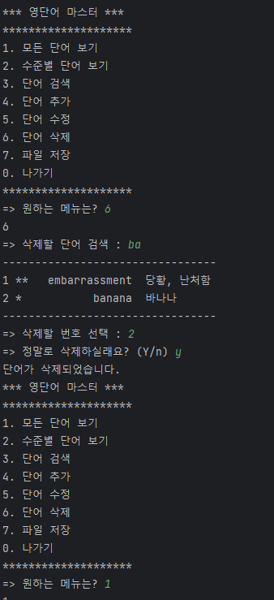
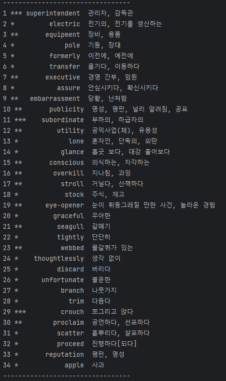

+ commend 7: 변화된 것을 파일에 저장한다.
+ 
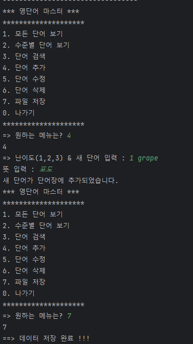
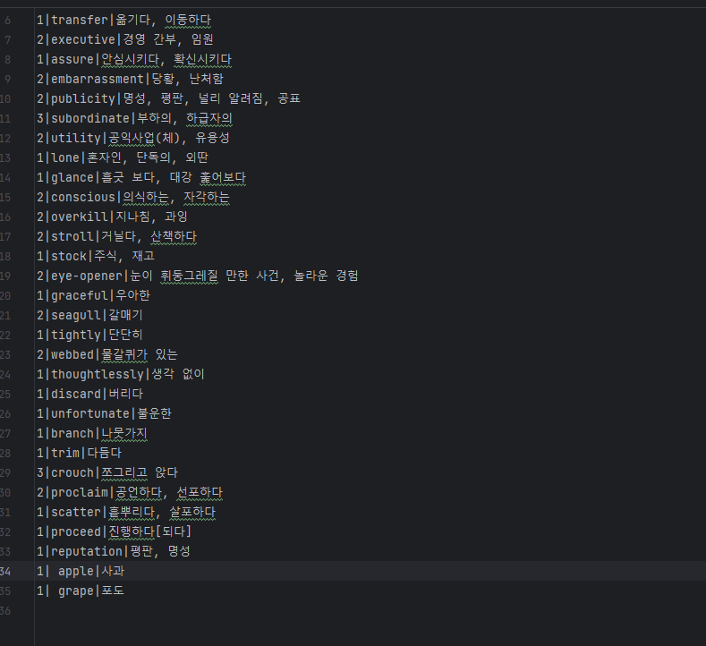

+ commend 0: 프로그램을 종료한다.

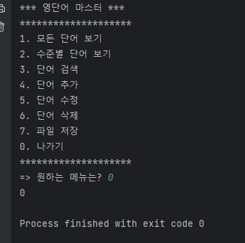

